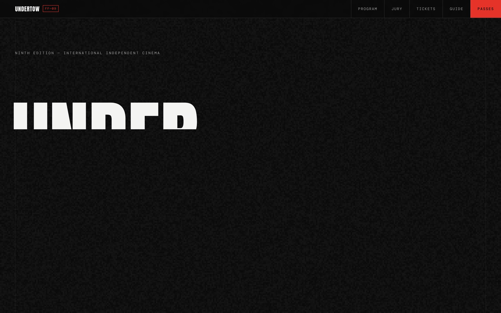

<!-- parable:beautified -->
<div align="center">

<h1>Undertow</h1>

<p><strong>Independent film festival — brutalist kinetic type + marquee tickers.</strong></p>

<p>
  <a href="https://bswxyz.github.io/undertow-festival/"></a>
  
  
  <a href="LICENSE"></a>
</p>

<p>
  <a href="https://bswxyz.github.io/undertow-festival/"><b>Live demo</b></a>
  &nbsp;·&nbsp;
  <a href="https://bswxyz.github.io/undertow-festival/guide/">Build notes</a>
  &nbsp;·&nbsp;
  <a href="https://parable-three.vercel.app/templates">More templates</a>
</p>

<a href="https://bswxyz.github.io/undertow-festival/">
  
</a>

</div>

**Use this template** — copy the source into a new project:

```bash
npx degit bswxyz/undertow-festival my-app
```


**Cinema that pulls you under.** A brutalist, poster-energy site for a fictional five-day
independent film festival in the coastal city of Cape Mora — premieres, 4K restorations,
midnight screenings, a jury with opinions.


Part of a 25-site design showcase by Parable. Every site is a distinct product concept with its
own type system, palette, motion signature, and Mobbin-researched interaction patterns.

---

## Concept

Festival posters don't whisper. Undertow is the poster wall as a website: pure black and bone
white, hairline rules, Anton at billboard scale, and one film red spent only where a poster
would stamp it — dates, prices, SOLD OUT. The interaction bones come from shipped ticketing
products (researched on Mobbin): cinema-app day tabs for the program, DICE's event-card
anatomy for each screening row, Eventbrite's tier microcopy for the passes. Sixteen invented
films, five invented jurors, three invented venues.

## Design system

| Token | Value | Role |
|---|---|---|
| `--bg` | `#0a0a0a` | the black wall |
| `--ink` | `#f4f4f2` | bone white type |
| `--dim` | `#a0a0a0` | secondary text (7.6:1 on bg) |
| `--faint` | `#5a5a5a` | decorative / disabled only |
| `--red` | `#e63329` | film red — dates, CTAs, stamps (4.58:1, AA) |
| `--line` | `rgba(244,244,242,.14)` | hairline rules |
| `--ease` | `cubic-bezier(.85,0,.15,1)` | "the guillotine" — abrupt, controlled |

**Type:** [Anton](https://fonts.google.com/specimen/Anton) (poster display) ·
[Inter](https://fonts.google.com/specimen/Inter) (body) ·
[DM Mono](https://fonts.google.com/specimen/DM+Mono) (times, venues, fine print).

**Motion signature:** letterpress hero (headline plates drop into an overflow sleeve, red
period stamps in at 2.4×), two counter-scrolling marquee tickers, canvas film grain with an
occasional 120ms "projector slip" frame jitter, and full-row poster inversion on hover.

## Stack

- Vanilla HTML / CSS / JS — no build step, no framework.
- [GSAP 3.12](https://gsap.com/) + ScrollTrigger via CDN (deferred) for the hero timeline and
  one scroll-scrubbed drift. The same signature bezier is solved numerically in JS so CSS and
  GSAP share one curve.
- Canvas 2D for film grain (six pre-rendered noise plates cycled at ~11fps).
- No images anywhere — the typography and texture are the identity.
- Progressive enhancement: a `.js` class gates every hidden state; the page is fully readable
  with JavaScript disabled (all five program days render stacked). `prefers-reduced-motion`
  freezes the tickers, disables grain/jitter, and makes reveals instant.

## Running locally

No install. Serve the folder over any static server (needed for font/CDN CORS niceties):

```bash
cd undertow-festival
python3 -m http.server 8826
# open http://localhost:8826
```

Or just open `index.html` in a browser — everything is relative-path.

## Structure

```
undertow-festival/
├── index.html        # the festival — hero, ticker, program tabs, jury, tickets
├── styles.css        # design tokens + all styling (tokens at the top)
├── main.js           # hero timeline, tabs, ticker pause, grain, jitter
├── guide/
│   └── index.html    # "How this was built" — idea, stack, technique with code
├── README.md
├── LICENSE           # MIT
├── .nojekyll         # serve as-is on GitHub Pages
└── .gitignore
```

## Demo vs. real

This is a **design showcase, not a functioning festival platform**. Honest inventory:

- **The entire program is fictional.** Films, directors, jurors, venues, the city of Cape Mora,
  the dates — all invented. Any resemblance to real films or people is coincidental.
- **No ticketing backend.** "Tickets" and pass CTAs link to on-page sections. There is no
  checkout, no payment processing, no order confirmation.
- **No seat/allocation inventory.** SOLD OUT stamps are hard-coded art direction, not state.
- **No accounts, no email, no CMS.** Program data is hand-written HTML.

To make it real you'd need: a ticketing provider or backend (inventory, holds, payments —
Stripe + a seats/allocations service, or an embed like DICE/Eventbrite), a schedule CMS so
programmers can edit screenings without touching markup, transactional email, real venue and
accessibility information, a privacy policy, and analytics that respect consent.

---

MIT © 2026 Parable · Designed & built by Parable — [how this was built →](https://bswxyz.github.io/undertow-festival/guide/)
